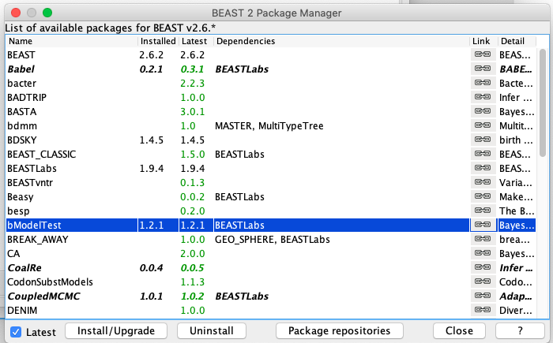
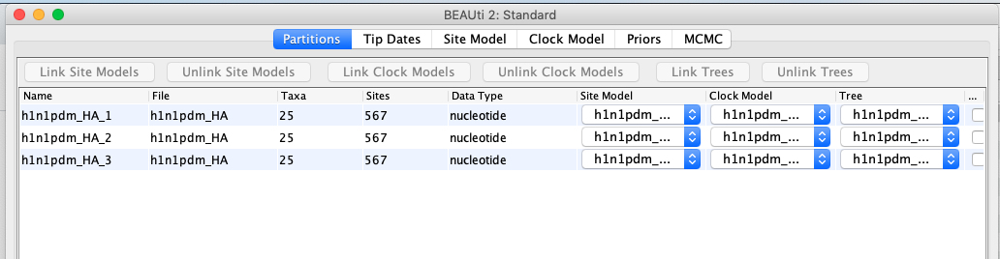
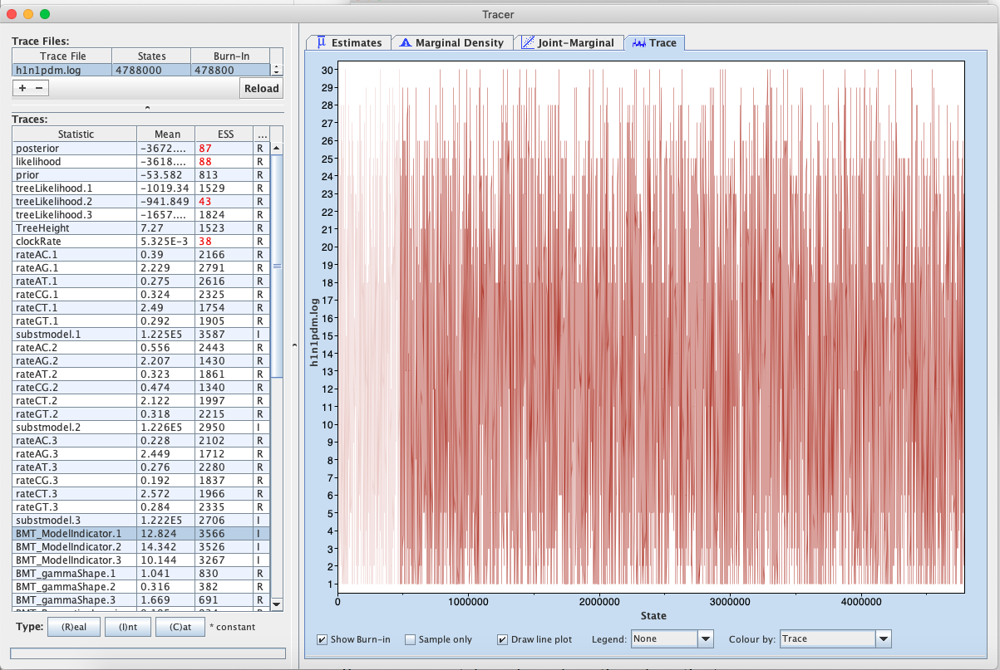
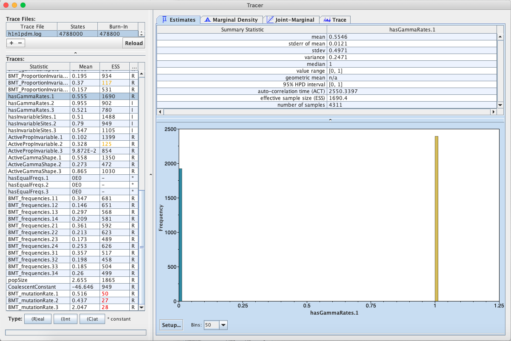
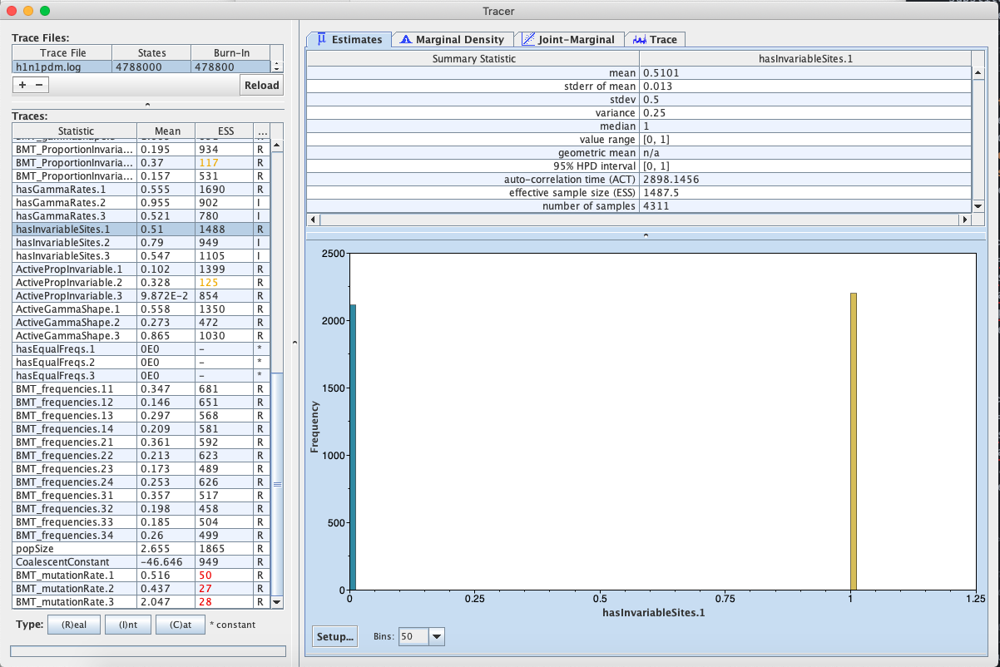
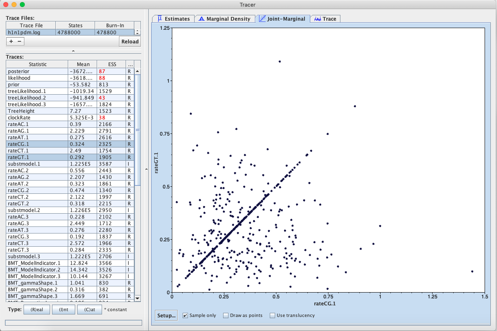
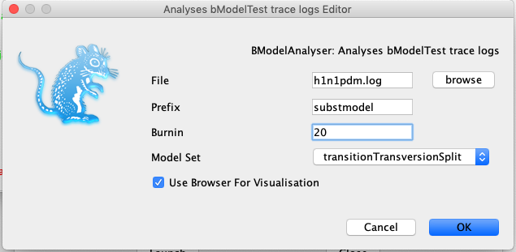
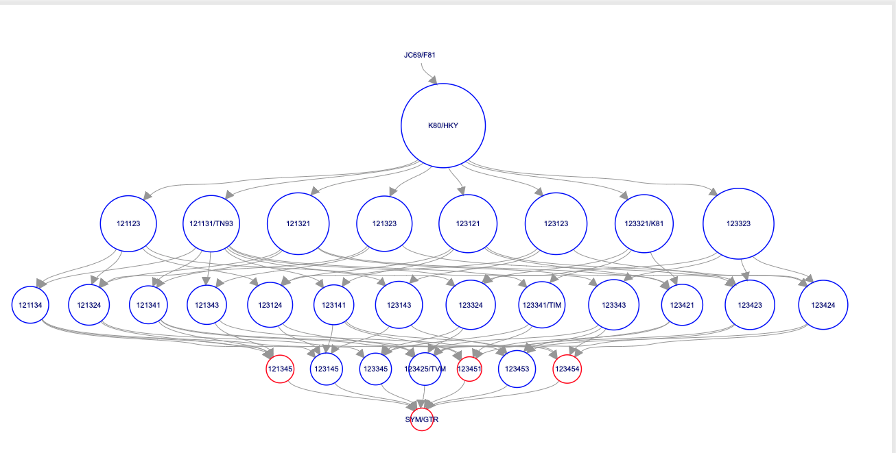

# Background

Before running any phylogenetic analysis in BEAST, we need to decide on a model of molecular evolution that describes how our sequence data evolved. In particular, we need to decide on a substitution model that describes the relative rates at which different types of substitutions occur. For nucleotide data, the substitution model is typically represented as a 4x4 symmetric rate matrix  with the general form:



The different named substitution models (e.g. JC69, HKY, TN93 and GTR) group these rates into different categories. For example, the JC69 model groups all rates together into a single rate category and assumes equal equilibrium frequencies whereas the GTR model assigns each rate to a different category and assumes a different equilibrium frequency for each nucleotide. We are therefore faced with the difficult choice of deciding *a priori* which one of these substitution models is most appropriate for our data.

> **Topic for discussion:** In terms of phylogenetic inference, what would the consequences be of picking a substitution model that is overparameterized (too complex) for a given data set? What would the consequences be of picking a model that is underparameterized? 
> 

In addition to the substitution model, we also need to decide whether to include rate heterogeneity across sites. We might also want to include a proportion of invariant sites. On top of all this, we need to decide whether to estimate nucleotide base frequencies or fix them at their empirical frequencies. All of these choices leads to a bewildering number of different models to choose from. For this reason, researchers have often based their model choice on common conventions rather than on which model is most appropriate for their data.   

Fortunately, nowadays we can be more sophisticated in our modeling choices and let the data inform us about which model is most appropriate using Bayesian model averaging. In this tutorial, we will use BEAST2's model averaging tool **bModelTest**  to select the most appropriate substitution model for the primate mitochondrial data set we already saw in the introductory tutorial. **bModelTest** uses reversible jump MCMC (rjMCMC), which allows the Markov chain to jump between states representing different possible substitution models, much like we jump between different parameter states in standard Bayesian MCMC inference. 
This allows us to treat the substitution model as a nuisance parameter and integrate over all _available_ (more on this later) substitution models while simultaneously estimating the phylogeny and other model parameters. Thus, parameter estimates are effectively averaged over different substitution models, weighted by the support of each model.
A useful consequence is that as we are exploring the space of different substitution models we also log the proportion of time that the Markov chain spends in a particular model state. This can be interpreted as the posterior support of a model, which tells us how strongly the data and our prior beliefs support a model in comparison to other competing models.

Note that **bModelTest** is only able to average over a subset of substitution models that are (a) implemented in BEAST2 and (b) that it knows how to move between. Ideally we would want to integrate over all possible substitution models, but since non-reversible models are mathematically inconvenient we restrict ourselves to the set of time-reversible (symmetric) nucleotide substitution models, which leaves us with 203 possible models. In addition, we can jump between models with empirical/estimated base frequencies, with/without gamma distributed rate heterogeneity and with/without invariant sites, resulting in a total of 203 x 2 x 2 x 2 = 1,624 possible model combinations. 

----

# Programs used in this Exercise

### BEAST2 - Bayesian Evolutionary Analysis Sampling Trees

BEAST2 ([http://www.beast2.org](http://www.beast2.org)) is a free software package for Bayesian evolutionary analysis of molecular sequences using MCMC and strictly oriented toward inference using rooted, time-measured phylogenetic trees. This tutorial is written for BEAST v{{ page.beastversion }} . 

### BEAUti2 - Bayesian Evolutionary Analysis Utility

BEAUti2 is a graphical user interface tool for generating BEAST2 XML configuration files.

Both BEAST2 and BEAUti2 are Java programs, which means that the exact same code runs on all platforms. For us it simply means that the interface will be the same on all platforms. The screenshots used in this tutorial are taken on a Mac OS X computer; however, both programs will have the same layout and functionality on both Windows and Linux. BEAUti2 is provided as a part of the BEAST2 package so you do not need to install it separately.

### Tracer 

Tracer ([http://tree.bio.ed.ac.uk/software/tracer](http://tree.bio.ed.ac.uk/software/tracer)) is used to summarise the posterior estimates of the various parameters sampled by the Markov Chain. This program can be used for visual inspection and to assess convergence. It helps to quickly view median estimates and 95% highest posterior density intervals of the parameters, and calculates the effective sample sizes (ESS) of parameters. It can also be used to investigate potential parameter correlations. We will be using Tracer v{{ page.tracerversion }}.

# Practical: Selecting a substitution model

In this tutorial we will go through an analysis using bModelTest in BEAST v{{ page.beastversion }} and look into how to interpret the results. This tutorial assumes that you have already done some of the other tutorials and that you are familiar with the basics of using BEAUti, BEAST and Tracer.

## Installing the bModelTest Package

We first have to install the bModelTest (version {{ page.bmodeltestversion }} or above) package.

> Open BEAUti and navigate to **File > Manage Packages**. Select bModelTest and then click **Install/Upgrade** ([Figure 1](#fig:install)). Then **_restart BEAUti_** to load the package.
>  

<figure>
	
	
	<figcaption>Figure 1: Installing bModelTest in the Manage Packages window in BEAUti</figcaption>
</figure>
 

## The Data

We will continue analyzing the primate mitochondrial data set from the introductory tutorial.

> Open BEAUti and navigate to **File > Import Alignment**. Select the file `primate-mtDNA.nex` in the data directory. 

## Setting up the analysis in BEAUti

In this tutorial, we will simplify things by having all four partitions in the alignment evolve under the same Site, Clock and Tree models.  

> In the **Partitions** panel select all four partitions (with **shift+click**) and then click **Link Site Models**, **Link Clock Models** and **Link Trees**. You should rename each model something more informative than noncoding, such as **site**, **clock** and **tree**. Rename models by **double-clicking** on the drop-down boxes.
> 

The Partition window should now look like [Figure 2](#fig:partitions).

<figure>
	
	
	<figcaption>Figure 2: Linking the Site Model across partitions in BEAUti.</figcaption>
</figure>
 

Now we want to set up our Site Model to run the model averaging analysis.

> Click the **Site Model** tab in BEAUti and then select the drop-down box at the top which says **Gamma Site Model** and change it to **BEAST ModelTest** ([Figure 3](#fig:siteModel)). 
> 

<figure>
	
	
	<figcaption>Figure 3: Setting up the BEAST ModelTest.</figcaption>
</figure>
 

In the lower drop-down box we will keep **transitionTransversionSplit** selected. This tells bModelTest to only consider substitution models that differentiate between transitions (A  G and C  T) and transversions (all other substitutions). Considering all the different ways we can group the rates in the substitution matrix, there are a total of 203 reversible models with symmetric matrices . However, if we only consider models that do not group transitions together with transversions, there are only 31 models. Selecting **transitionTransversionSplit** therefore dramatically reduces the number of models that we need to explore.

In the **Clock Model** and **Prior** tabs, we do not need to change any of the default settings for this tutorial.

> Click the **MCMC** tab in BEAUti. Change the chain length to 5,000,000 and the sampling frequency to every 5,000. Change the **tracelog** and **treelog** file names to `primate-mtDNA-bMT` and then click **File > Save As** and save as `primate-mtDNA-bMT.xml`.
> 

## Run the analysis in BEAST

> Open BEAST and choose `primate-mtDNA-bMT.xml` as the BEAST XML File ([Figure 4](#fig:beastRun)). If BEAGLE is installed check the box to use it. Then click **run**.
> 

<figure>
	
	
	<figcaption>Figure 4: Running the analysis in BEAST.</figcaption>
</figure>
 

While BEAST is running consider the following discussion points.

We did not check **estimate** in the box next to the Mutation Rate in the **Site Model** tab. Doing so makes no difference, since BEAUti constrains the mean mutation rate of all partitions to be equal to 1 (by default). Since we linked the substitution model across all partitions we effectively have only one partition, thus the mutation rate is fixed to 1. 

Note that BEAUti (by default) does not allow us to estimate the clock rate in the **Clock Model** tab. In this analysis we only have contemporaneously sampled sequences and we did not set a calibration node as in the introductory tutorial. Thus, we have no temporal information and the clock rate is not uniquely identifiable. To make the model identifiable BEAUti arbitrarily fixes the clock rate to 1.

> **Topics for discussion:** 
>
> - We cannot estimate the substitution rate, so branches in the tree will not be measured in units of time. What will be the units for branch lengths in the estimated tree?
> 
> - Suppose we used individual substitution models for each partition. What does the estimated mutation rate for each partition represent? Would the rate of each partition be identifiable?
>
> - What would happen if we removed the constraint to have a mean mutation rate of 1? What if we also added a calibration point?
>

## Analyzing the output in Tracer

> Open the `primate-mtDNA-bMT.log` file in Tracer. There should be a long list of entries in the window on the left hand side ([Figure 5](#fig:modelTrace)).
> 

If we select **BMT_ModelIndicator** from the list of entries and then **(I)nt** for the Data type below, we can see how the Markov chain explored the space of different models by jumping between substitution models. This is best seen if we click on the **Trace** tab ([Figure 5](#fig:modelTrace)). Here, the sampled integer values refer to the indexes of the different substitution models. To see which index corresponds to which model, refer to ([Figure 6](#fig:modelIndexes)).

Now click on the **Estimates** tab above. This frequency histogram shows us how much time the Markov chain spent in each model state relative to other model states, and therefore reflects the posterior support for each model. We can see that the chain spent the most time in model number 1 ([Figure 7](#fig:modelPosterior)), which by consulting [Figure 6](#fig:modelIndexes) we see corresponds to the HKY model. 

<figure>
	
	
	<figcaption>Figure 5: Visualizing how the Markov chain explored different models in Tracer.</figcaption>
</figure>
 

<figure>
	
	
	<figcaption>Figure 6: A list of substitution models, their associated model number (index) and how the substitution rates are grouped.</figcaption>
</figure>
 

<figure>
	
	
	<figcaption>Figure 7: Visualizing the posterior support for different substitution models in Tracer.</figcaption>
</figure>
 

> **Topic for discussion:** Did the chain ever visit the JC69 model? Why not?
> 

We can also use the output of our analysis to see if a model with (gamma) rate heterogeneity and/or a proportion of invariant sites is supported. If we select **hasGammaRates** in the window on the left and then click **Estimates** we see the proportion of time the chain spent in a model state with rate heterogeneity on (1) versus off (0), and thus the posterior support for a model with rate heterogeneity. Here, the chain seems to remain in a state with rate heterogeneity on, indicating very strong support for heterogeneity ([Figure 8](#fig:hasGammaRates)).  We can also select **hasInvariableSites** to see if a model with invariant sites is supported. Here we see that the model spends more time in a model state with invariant sites off (0) than on (1), indicating that the presence of invariant sites are not as strongly supported important ([Figure 9](#fig:hasInvariableSites)). Note that we can also look at the traces for **BMT_gammaShape** and **BMT_ProportionInvariant** to see which values of these two parameters the chain visited.

There are a few other things we can look at in Tracer as well:

-  **rateAC, ... ,rateGT** are the substitution rates between pairs of nucleotides in the substitution matrix. Note that these rates are averaged over all the models, weighted by the time the Markov chain spent in each model state.
-  **BMT_Rates.1 to 6** are the independent substitution rates used to build up the rate matrix. They are indexed by how they are grouped into the six different possible rate categories (see [Figure 6](#fig:modelIndexes)). Note that not all the models averaged over use all 6 independent rate parameters.
-  **ActiveGammaShape/PropInvariable** are the gamma shape parameter and the proportion of variables sites when active, that is, when **hasGammaRates** and **hasInvariableSites** are selected. To get the estimate of the mean of the shape parameter, divide the mean **ActiveGammaShape** by the mean of **hasGammaRates**.
-  **hasEqualFreqs** indicates if the chain is in a state with equal nucleotide base frequencies. 

<figure>
	
	
	<figcaption>Figure 8: The posterior support for including gamma rate heterogeneity.</figcaption>
</figure>
 

<figure>
	
	
	<figcaption>Figure 9: The posterior support for including a proportion of invariant sites.</figcaption>
</figure>
 

> **Topic for discussion:** Why does **BMT_Rates.6** not mix poorly? 
>
> **Hint:** Look at the table of substitution models and the distribution and trace of **BMT_ModelIndicator** in Tracer. 
>
> **Bonus hint:** Look at the trace for **BMT_Rates.6** and plot the joint-marginal between **BMT_Rates.1** and **BMT_Rates.2**.
>

Select pairs of the **rateAC, ... ,rateGT** parameters (using **shift+click**) and click on the **Joint-Marginal** tab to investigate parameter correlations ([Figure 10](#fig:rateCorrelations)). Try looking at **rateAT** vs. **rateCG** and **rateCG** vs **rateGT**). 

<figure>
	
	
	<figcaption>Figure 10: Correlations between rate parameters.</figcaption>
</figure>
 

> **Topic for discussion:** It appears that some pairs of the rate parameters are highly correlated for some samples and uncorrelated for the rest. What is happening here? Should we be worried about these parameter correlations? 
>
> Do you also see correlations between the **BMT_Rates.1 to 6** parameters?
>

## Analyzing the output using BModelAnalyzer

Another really nice feature of bModelTest is that we can graphically analyze the output using the **BModelAnalyser App**.

> In BEAUti, select **File > Launch Apps** and then launch the **BModelAnalyser App**.  A dialogue window should pop up ([Figure 11](#fig:analyzerDialogue)). Enter `primate-mtDNA-bMT.log` as the file to analyze. You can leave the other entries at their default settings but make sure **transitionTransversionSplit** is selected for the Model Set and the box next to **Use Browser For Visualization** is checked. Then click **OK**.
> 

<figure>
	
	
	<figcaption>Figure 11: Running the BModelAnalyser App.</figcaption>
</figure>
 

After BModelAnalyser runs, a new window should appear in your default web browser that represents the model selection results graphically ([Figure 12](#fig:modelGraph)). This graph depicts the nested relationship of the different substitution models: an arrow pointing from one model to another indicates that the model at the tail is nested within the model at the head of the arrow. As we can see, JC69 is nested within all other models and all other models are nested within GTR.

<figure>
	
	
	<figcaption>Figure 12: A graphical representation of the model selection results produced by BModelAnalyzer.</figcaption>
</figure>
 

The area of the circle surrounding each model is proportional to the the posterior support for that model. The colours represent whether the model is contained within the 95% credible set (blue) or not (red). For the primate data set, the HKY model clearly has the highest posterior support ([Figure 12](#fig:modelGraph)). However, other models such as TN93 and two unnamed models, **121323** and **121123**, also have fairly high posterior support. The six digit model code describes how the different substitution rates are grouped in the order of , , , ,  and . For instance, **121323** is a slight variant of the HKY model with an additional group for the rates  and . The six digit codes for all models are shown in [Figure 6](#fig:modelIndexes).

> **Topic for discussion:** We have used bModelTest to explore a large set of substitution models. But how do we know that any of the substitution models actually fit the observed sequence data well?
> 

---

# Acknowledgment

This tutorial is based on the original bModelTest tutorial by Remco Bouckaert.

# Useful Links

- Official bModelTest documentation: [https://github.com/BEAST2-Dev/bModelTest/wiki](https://github.com/BEAST2-Dev/bModelTest/wiki)
-  The original bModelTest tutorial is available here: [https://github.com/BEAST2-Dev/bModelTest/releases/download/v0.3.0/bModelTestTutorial.pdf](https://github.com/BEAST2-Dev/bModelTest/releases/download/v0.3.0/bModelTestTutorial.pdf) and is also included in the source code.

----

# Relevant References


