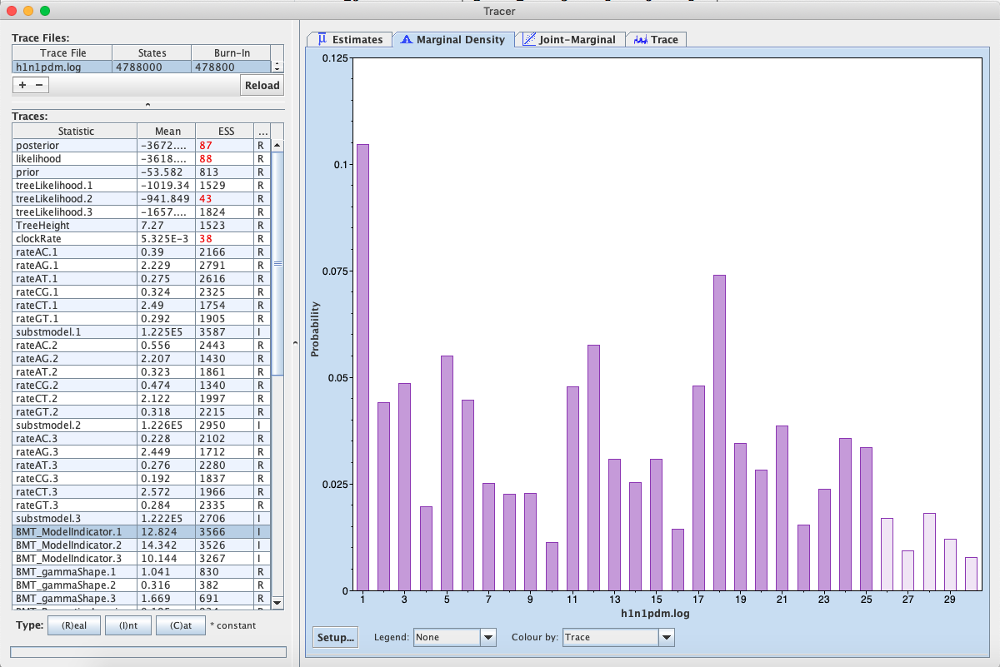

# Background

Before running any phylogenetic analysis in BEAST, we need to decide on a model of molecular evolution that describes how our sequence data evolved. In particular, we need to decide on a substitution model that describes the relative rates at which different types of substitutions occur. For nucleotide data, the substitution model is typically represented as a 4x4 symmetric rate matrix  with the general form:



The different named substitution models (e.g. JC69, HKY, TN93 and GTR) group these rates into different categories. For example, the JC69 model groups all rates together into a single rate category whereas the GTR model assigns each rate to a different category. We are therefore faced with the difficult choice of deciding *a priori* which one of these substitution models is most appropriate for our data.

> **Topic for discussion:** In terms of phylogenetic inference, what would be the consequence of picking a substitution model that is overparameterized (too complex) for a given data set? What would be the consequence of picking a model that is underparameterized? 
> 

In addition to the substitution model, we also need to decide whether to include rate heterogeneity across sites. We also might want to include a proportion of invariant sites. On top of all this, we need to decide whether to estimate nucleotide base frequencies or fix them at their empirical frequencies. All of these choices leads to a bewildering number of different models to choose from. For this reason, researchers have often based their model choice on common conventions rather than on which model is most appropriate for their data.   

Fortunately, nowadays we can be more sophisticated in our modeling choices and let the data inform us about which model is most appropriate using Bayesian model selection. In this tutorial, we will use BEAST's model selection tool **bModelTest**  to select which substitution model is most appropriate for the primate mitochondrial data set we already saw in the introductory tutorial. bModelTest uses reversible jump MCMC (rjMCMC), which allows the Markov chain to jump between states representing different possible substitution models much like we jump between different parameter states in standard Bayesian MCMC inference. This allows us to explore the space of different models while simultaneously estimating model parameters and the phylogeny. Best of all, the proportion of time the Markov chain spends in a particular model state can be interpreted as the posterior support for that model, which tells us how much the data and our prior beliefs support the model over other competing models.

----

# Programs used in this Exercise

-  BEAUTi v{{ page.beastversion }} 
-  BEAST v{{ page.beastversion }}
-  Tracer v{{ page.tracerversion }}
-  bModelTest v{{ page.bmodeltestversion}} (installed during this tutorial)

# Practical: Selecting a substitution model

## Installing the bModelTest Package

We first have to install the bModelTest version {{ page.bmodeltestversion }} package.

> Open BEAUti and navigate to **File > Manage Packages**. Select bModelTest and then click **Install/Upgrade** ([Figure 1](#fig:install)). Then **_restart BEAUti_** to load the package.
>  

<figure>
	
	
	<figcaption>Figure 1: Installing bModelTest in the Manage Packages window in BEAUti</figcaption>
</figure>
 

## The Data

We will continue analyzing the primate mitochondrial data set from the introductory tutorial.

> Open BEAUti and navigate to **File > Load**. Select the file `primate-mtDNA.nex`. 

## Setting up the analysis in BEAUti

In this tutorial, we will simplify things by having all four partitions in the alignment evolve under the same Site, Clock and Tree models.  

> In the **Partitions** panel select all four partitions and then click **Link Site Models**, **Link Clock Models** and **Link Trees**. You should rename each model something more informative than noncoding, such as **site**, **clock** and **tree**. 
> 

The Partition window should now look like [Figure 2](#fig:partitions).

<figure>
	
	
	<figcaption>Figure 2: Linking the Site Model across partitions in BEAUti.</figcaption>
</figure>
 

Now we want to set up our Site Model to run the model selection analysis.

> Click the **Site Model** tab in BEAUti and then select the drop down box at the top which says **Gamma Site Model** and change it to **BEAST ModelTest** ([Figure 3](#fig:siteModel)). Select **estimate** in the box next to the Mutation Rate.
> 

<figure>
	
	
	<figcaption>Figure 3: Setting up the BEAST ModelTest.</figcaption>
</figure>
 

In the lower drop down box we will keep **transitionTransversionSplit** selected. This tells bModelTest to only consider substitution models that differentiate between transitions (A  G and C  T) and transversions (all other substations). Considering all the different ways we can group the rates in the substitution matrix, there are a total of 203 reversible models with symmetric matrices . However, if we only consider models that do not group transitions together with transversions, there are only 31 models. Selecting **transitionTransversionSplit** therefore dramatically reduces the number of models that we need to explore.

In the **Clock Model** and **Prior** tabs, we do not need to change any of the default settings for this tutorial.

> Click the **MCMC** tab in BEAUti. Change the chain length to 10,000,000. Change the **tracelog** and **treelog** file names to `primate-mtDNA-bMT` and then click **File > Save As** and save as `primate-mtDNA-bMT.xml`.
> 

## Run the analysis in BEAST

> Open BEAST and choose `primate-mtDNA-bMT.xml` as the BEAST XML File ([Figure 4](#fig:beastRun)). Then click run.
> 

<figure>
	
	
	<figcaption>Figure 4: Running the analysis in BEAST.</figcaption>
</figure>
 

## Analyzing the output in Tracer

> Open the `primate-mtDNA-bMT.log` file in Tracer. There should be a long list of entries in the window on the left hand side ([Figure 5](#fig:modelTrace)).
> 

If we select **BMT_ModelIndicator** from the list of entries and then **(I)nt** for the Data type below, we can see how the Markov chain explored the space of different models by jumping between substitution models. This is best seen if we click on the **Trace** tab ([Figure 5](#fig:modelTrace)). Here, the sampled integer values refer to the indexes of the different substitution models. To see which index corresponds to which model, refer to ([Figure 6](#fig:modelIndexes)).

Now click on the **Estimates** tab above. This frequency histogram shows us how much time the Markov chain spent in each model state relative to other model states, and therefore reflects the posterior support for each model. We can see that the chain spent the most time in model number 1 ([Figure 7](#fig:modelPosterior)), which by consulting [Figure 6](#fig:modelIndexes) we see corresponds to the HKY model. 

<figure>
	
	
	<figcaption>Figure 5: Visualizing how the Markov chain explored different models in Tracer.</figcaption>
</figure>
 

<figure>
	
	
	<figcaption>Figure 6: A list of substitution models, their associated model number (index) and how the substitution rates are grouped.</figcaption>
</figure>
 

<figure>
	
	
	<figcaption>Figure 7: Visualizing the posterior support for different substitution models in Tracer.</figcaption>
</figure>
 

We can also use the output of our analysis to see if a model with (gamma) rate heterogeneity and/or a proportion of invariant sites is supported. If we select **hasGammaRates** in the window on the left and then click **Estimates** we see the proportion of time the chain spent in a model state with rate heterogeneity on (1) versus off (0), and thus the posterior support for a model with rate heterogeneity. Here, the chain seems to remain in a state with rate heterogeneity on, indicating that we should probably include rate heterogeneity ([Figure 8](#fig:hasGammaRates)).  We can also select **hasInvariableSites** to see if a model with invariant sites is supported. Here we see that the model spends more time in a model state with invariant sites off (0) than on (1), indicating that including invariant sites might not be so important ([Figure 9](#fig:hasInvariableSites)). Note that we can also look at the traces for **BMT_gammaShape** and **BMT_ProportionInvariant** to see what values of these two parameters the chain visited.

There are a few other things we can look at in Tracer as well:

-  **rateAC, ... ,rateGT** are the individual substitution rates the chain visited. 
-  **BMT_Rates.1 to 6** are also the substitution rates, but indexed by how they are grouped into the six different possible rate categories (see [Figure 6](#fig:modelIndexes)). 
-  **ActiveGammaShape/PropInvariable** are the gamma shape parameter and the proportion of variables sites when active, that is, when **hasGammaRates** and **hasInvariableSites** are selected. To get the estimate of the mean of the shape parameter, divide the mean **ActiveGammaShape** by the mean of **hasGammaRates**.
-  **hasEqualFreqs** indicates if the chain is in a state with equal nucleotide base frequencies. 

<figure>
	
	
	<figcaption>Figure 8: The posterior support for including gamma rate heterogeneity.</figcaption>
</figure>
 

<figure>
	
	
	<figcaption>Figure 9: The posterior support for including a proportion of invariant sites.</figcaption>
</figure>
 

## Analyzing the output using BModelAnalyzer

Another really nice feature of bModelTest is that we can graphically analyze the output using the **BModelAnalyser App**.

> In BEAUti, select **File > Launch Apps** and then launch the **BModelAnalyser App**.  A dialogue window should pop up (Figure 10](#fig:analyzerDialogue)). Enter `primate-mtDNA-bMT.log` as the file to analyze. You can leave the other entries at their default settings but make sure **transitionTransversionSplit** is selected for the Model Set and the box next to **Use Browser For Visualization** is checked. Then click **OK**.
> 

<figure>
	
	
	<figcaption>Figure 10: Running the BModelAnalyser App.</figcaption>
</figure>
 

After BModelAnalyser runs, a new window should appear in your default web browser that represents the model selection results graphically (Figure 11](#fig:modelGraph)). This graph depicts the nested relationship of the different substitution models: an arrow pointing from one model to another indicates that the model at the tail is nested within the model at the head of the arrow. As we can see, JC69 is nested within all other models and all other models are nested within GTR.

<figure>
	
	
	<figcaption>Figure 11: A graphical representation of the model selection results produced by BModelAnalyzer.</figcaption>
</figure>
 

The area of the circle surrounding each model is proportional to the the posterior support for that model. The colors represent whether the model is contained within the 95% credible set (blue) or not (red). For the primate data set, the HKY model clearly has the highest posterior support ([Figure 11](#fig:modelGraph)). However, other models such as TN93 and two unnamed models, **121323** and **121123**, also have fairly high posterior support. The six digit model code describes how the different substitution rates are grouped in the order of , , , ,  and . For instance, **121323** is a slight variant of the HKY model with an additional group for the rates  and . The six digit codes for all models are shown in [Figure 6](#fig:modelIndexes).

> **Topic for discussion:** We have used bModelTest to explore a large set of substitution models. But how do we know that any of the substitution models actually fit the observed sequence data well?
> 

# Useful Links

-  The original bModelTest tutorial [https://github.com/BEAST2-Dev/bModelTest/tree/master/doc/tutorial](https://github.com/BEAST2-Dev/bModelTest/tree/master/doc/tutorial) 

----

# Relevant References


